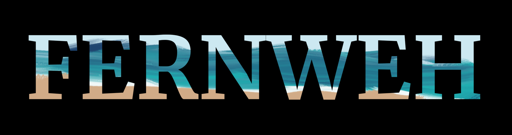
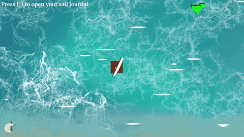
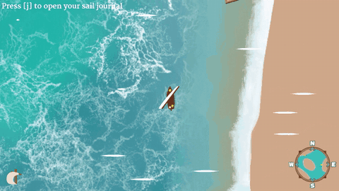

  

<strong>A sailing adventure driven by wind.</strong>

  <a href="https://ivanpavlov.itch.io/fernweh"><strong>Play in your browser</strong></a>
  &nbsp; · &nbsp;
  <a href="docs/DEVELOPMENT.md">Open the project</a>
  &nbsp; · &nbsp;
  <a href="docs/PROJECT.md">Explore the source</a>

Set out from an ancient coast and discover what lies beyond the horizon. Turn a simple raft into a wind-powered journey: trim your sail, find your course, and help the people you meet along the shore.

**FERNWEH** is a top-down sailing prototype by [Ivan Pavlov](https://ivanpavlov.itch.io/), built with Unity and C#. The [browser demo](https://ivanpavlov.itch.io/fernweh) takes about **10 minutes** to complete.

| Catch the wind | Find your way along the coast |
| :---: | :---: |
|  |  |

## The prototype

- **Feel the wind.** Sail angle and wind direction shape how your raft or boat moves.
- **Learn through a short voyage.** Five story levels introduce sailing, rescuing fishermen, and bringing passengers ashore.
- **Choose your language.** English, German, Japanese, and Russian are available from the main menu.

The repository also contains experiments with other sailing controls and broader quest and progression systems. The playable prototype follows a sequence of story levels; an expanded open world is a future direction described on the [itch.io page](https://ivanpavlov.itch.io/fernweh).

## Controls

| Input | Action |
| --- | --- |
| Mouse | Aim the sail |
| **Q** / right mouse button | Raise or lower the sail |
| **Space** / left mouse button | Paddle / give the raft or boat a small push |
| **A** / **D** | Steer the boat |
| **J** / **Esc** | Open or close the sail journal / pause menu |

These are the story prototype controls. The in-game tutorials introduce them as you progress.

## Work on the game

Open the repository in **Unity 6000.3.25f1**, let packages and assets import, then open [`Main Menu.unity`](Assets/Sailboat/Scenes/Transition/Main%20Menu.unity) and press **Play**. The setup guide covers Addressables configuration for a fresh checkout.

- [Development guide](docs/DEVELOPMENT.md) — setup, builds, and a quick playtest checklist.
- [Project map](docs/PROJECT.md) — scenes, sailing, wind, and content entry points.
- [Credits](docs/CREDITS.md) — asset and tool acknowledgements.

Feedback on the game is welcome on [itch.io](https://ivanpavlov.itch.io/fernweh#comments); code issues can be reported in [GitHub Issues](https://github.com/IvanPavlov7007/FERNWEH/issues).
